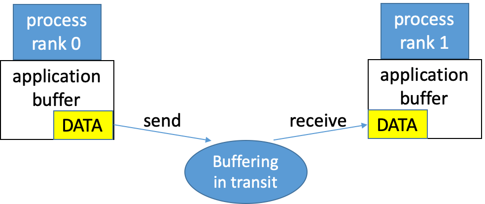
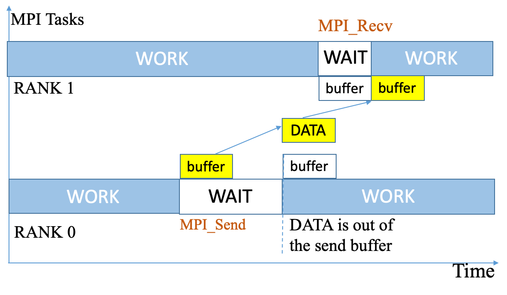
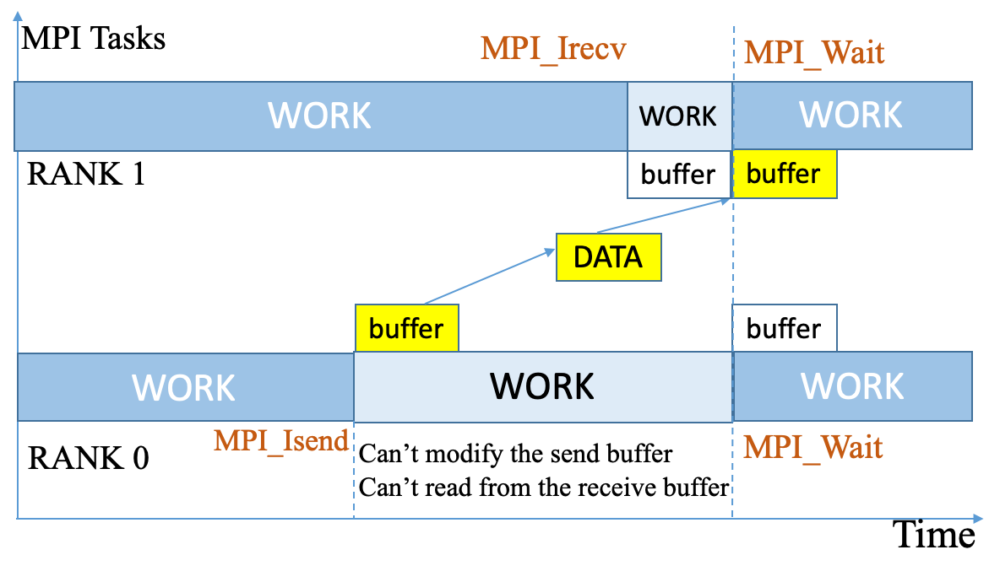
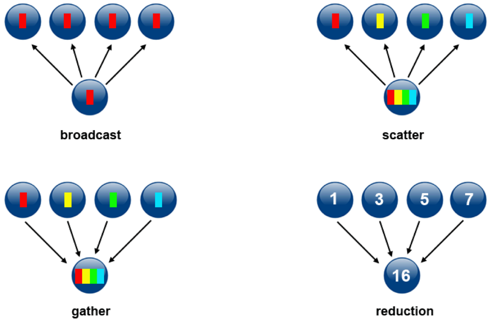

<style type="text/css">
    /* 1. Style header/footer <div> so they are positioned as desired. */
    #header-left {
        position: absolute;
        top: 2.5%;
        left: 2.5%;
    }
    #header-right {
        position: absolute;
        top: 2.5%;
        right: 2.5%;
    }
    
    #footer-left {
        position: absolute;
        bottom: 2.5%;
        left: 2.5%;
    }
    
    #footer-right {
        position: absolute;
        bottom: 2.5%;
        right: 2.5%;
    }
    
</style>

<!-- 2. Create hidden header/footer <div> -->
<div id="hidden" style="display:none;">
    <div id="header">
        <div id="header-left"><font size=1 color='D33513'> <i>Feb 7 2024:   <b>MPI</b></i></font> </div>
        <div id="header-right"></div>
    </div>
</div>

<script src="https://code.jquery.com/jquery-2.2.4.min.js"></script>
<script type="text/javascript">
    // 3. On Reveal.js ready event, copy header/footer <div> into each `.slide-background` <div>
    var header = $('#header').html();
    if ( window.location.search.match( /print-pdf/gi ) ) {
        Reveal.addEventListener( 'ready', function( event ) {
            $('.slide-background').append(header);
        });
    }
    else {
        $('div.reveal').append(header);
   }
</script>


<br><br><br>
<center>
<font size=7 color='D33513'> Linux Cluster Institute: </font>
</center>
<br>
<center>
<font size=6 color='D33513'>
Introduction to parallel programming techniques
<br>
Part II:  MPI

</font>

</center>


<br><br>

    
<center>
    Alan Chapman
</center>
<center>
HPC Systems Analyst
</center>
<center>
Arizona State University
</center>

<br><br>

## Outline of the presentation

- What is MPI and how it works
- MPI program structure
- Environment management routines
- How to compile and run MPI program
- MPI point-to-point communications
         Blocking and non-blocking send/receive routines
- MPI collective communication routines
         MPI_Reduce example
- Domain decomposition and MPI task farming
- MPI lab exercises review


## Message Passing Interface (MPI)

- Processes run on network distributed hosts and communicate by exchanging messages. 
- A community of communicating processes is called a Communicator. MPI_COMM_WORLD is the default.
- Inside the communicator, each process is assigned its rank. 
- Each process runs the same code (SPMD model)


## How an MPI Run Works

- Every process gets a copy of the same executable: Single Program, Multiple Data (SPMD).
- They all start executing it.
- Each process works completely independently of the other processes, except when communicating.
- Each looks at its own rank to determine which part of the problem to work on.


## MPI is SPMD

To differentiate the roles of various processes running the same MPI code, you have to have if statements for the rank number.
Often, the rank 0 process is referred as a master, and the other as a worker.
```c
if (my_rank == 0) {
       //do the master tasks
}

# similarly,

if (my_rank != 0) {
       //do the worker tasks
} 
```


## General MPI program structure

MPI include header file `#include "mpi.h"` 

Initialize MPI environment 

Main coding and Message Passing calls 

Terminate MPI environment


## Major Environment Management Routines

```cpp
// Data initialization

MPI_Init (&argc, &argv)     //MPI initialization
MPI_Comm_size (comm, &size) //Learn the number prticipating processes
MPI_Comm_rank (comm, &rank) //Learn my rank

// Some work is done here
// Some MPI message passing involved

MPI_Abort (comm, errorcode) //Terminate MPI at some conditions

MPI_Get_processor_name (&name, &resultlength) //Learn my processr name

MPI_Finalize () //Complete the MPI run
```


## MPI code template without send/receive.

Each process initializes the MPI environment, 
then prints out the number of processes, its rank, and the hostname

```cpp
#include "mpi.h"
#include <stdio.h>

int main(int argc, char *argv[]) {
   int  numtasks, rank, len, rc; 
   char hostname[MPI_MAX_PROCESSOR_NAME];

          // initialize MPI  
   MPI_Init(&argc, &argv);
         
        // get MPI process rank, size, and processor name
   MPI_Comm_size(MPI_COMM_WORLD, &numtasks);
   MPI_Comm_rank(MPI_COMM_WORLD, &rank);
   MPI_Get_processor_name(hostname, &len); 
   printf ("Number of tasks= %d My rank= %d Running on %s\n", numtasks, rank, hostname);
        
        // Here we can do some computing and message passing ….  
        
        // done with MPI  
   MPI_Finalize(); 
}
```


## MPI compilation and run examples

```bash
mpicc  -o hello.x  hello.c
```
To run the executable with 8 tasks on the same node:


```bash
mpirun  -n 8   hello.x
```

To run the executable across 8 CPUs via SLURM on a cluster:
```bash
srun  -n 8   hello.x
```

To run the executable across 2 nodes, 8 CPUs, and without a queue system:
```bash
mpirun  -n 8  -hostfile  nodes.txt  hello.x
```

The hostfile, nodes.txt, defines CPU allocation, for example:
 nodes.txt
```yaml
node01  slots=4
node02  slots=4
```


## MPI point-to-point communications

In two communicating MPI processes, one task is performing a send operation and the other task is performing a matching receive operation. 

Blocking send/receive calls:

```cpp
MPI_Send(&buffer, count, type, dest, tag, comm)
```
```cpp
MPI_Recv(&buffer, count, type, source, tag, comm, status)
```
in MPI_Send
```yaml
buffer – data elements, variables
count – the number of elements
type – MPI data type
dest - rank of the receiving process
tag – int number, unique msg id
comm – communicator
```

in MPI_Recv
```yaml
buffer – data elements, variables
count – the number of elements
source – rank of the sending proc
tag – int number, unique msg id
comm – communicator
status - communication status 
```


## Some most commonly used MPI data types

| MPI C/C++ data types  |        C/C++ data types
|:-  | -:  
|MPI_INT	|  int
|MPI_LONG   |  long int
|MPI_LONG_LONG  | long long int
|MPI_CHAR       |  char
|MPI_UNSIGNED_CHAR | unsigned char
|MPI_UNSIGNED       | unsigned int
|MPI_UNSIGNED_LONG  | unsigned long int
|MPI_UNSIGNED_LONG_LONG  | unsigned long long int
|MPI_FLOAT | float
|MPI_DOUBLE | double
|MPI_LONG_DOUBLE | long double 


There are also other data types in MPI. 

MPI also allows user defined data types.


## Blocking send/receive example


Two processes with rank 0 and 1 initialize variables and the MPI environment, 
then  the process of rank 0 sends a message to the rank 1 process
```c  
if (rank == 0) {
   //send a message to proc 1
   dest = 1;
   MPI_Send(&outmsg, 9, MPI_CHAR, dest, tag, MPI_COMM_WORLD);
 }

if (rank == 1) {
   //receive a message from proc 0
    source = 0;
  MPI_Recv(&inmsg, 9, MPI_CHAR, source, tag, MPI_COMM_WORLD, &Stat);
}
```


## Blocking MPI send/receive code example.

Each process initializes the MPI environment, 
then process with rank 0 sends “LCI_2022” string
to rank 1

```c
#include "mpi.h"
#include <stdio.h>
int main(int argc, char *argv[]) {
int numRanks, rank, dest, source, rc, count, tag=222;
char inmsg[9], outmsg[9]="LCI_2022";
MPI_Status Stat;
MPI_Init(&argc,&argv);
MPI_Comm_size(MPI_COMM_WORLD, &numRanks);
MPI_Comm_rank(MPI_COMM_WORLD, &rank);

if (rank == 0) {
  dest = 1;
  MPI_Send(&outmsg, 9, MPI_CHAR, dest, tag, MPI_COMM_WORLD);
  }
else if (rank == 1) {
  source = 0;
  MPI_Recv(&inmsg, 9, MPI_CHAR, source, tag, MPI_COMM_WORLD, &Stat);
  printf("Rank %d Received %s from Rank %d \n", rank, inmsg, source);
}
MPI_Finalize();
```


## Compiling and running the MPI blocking send/receive code

```bash
mpicc  -o  b_send_receive.x  b_send_receive.c
mpirun -n 2  b_send_receive.x
```

output:
```
    Rank 1 Received LCI_2022 from Rank 0 
    Task 1: Received 9 char(s) from task 0 with tag 222 
```


## MPI send/receive buffering

The MPI implementation (not the MPI standard) decides what happens to data between send/receive. Typically, a system buffer area is reserved to hold data in transit.





## The blocking send/receive work flow

`MPI_Send` returns after it is safe to modify the send buffer.

`MPI_Recv` returns after the data has arrived in the receive buffer.





## MPI non-blocking send/receive


The process of rank 0 sends a message to the rank 1 process via `MPI_Isend`, then continues running. 

The rank 1 process may retrieve the data from the buffer later via `MPI_Irecv`.  

Neither the send buffer can be updated, nor the receive buffer can be read until the processes make a synchronization call,  `MPI_wait`.
 
```c
if (rank == 0) {
//send a message to proc 1
dest = 1;
MPI_Isend(&outmsg, 9, MPI_CHAR, dest, tag, MPI_COMM_WORLD, &request);
   }

if (rank == 1) {
//receive a message from proc 0
source = 0;
MPI_Irecv(&inmsg, 9, MPI_CHAR, source, tag, MPI_COMM_WORLD, &request);
  }
MPI_wait(&request, &Stat);
```


## The non-blocking send/receive work flow

The `MPI_Isend` returns right away, and the rank 0 process continues running. The rank 1 process may call `MPI_Irecv` later. The send buffer shouldn’t be updated and the receive buffer shouldn’t be read until `MPI_Wait` is called by the both tasks.




## Non-Blocking MPI send/receive code example.

Each process initializes the MPI environment, 
then process with rank 0 sends “LCI_2022” string to rank 1

```c
#include "mpi.h"
#include <stdio.h>

int main(int argc, char *argv[]) {
int numRanks, rank, dest, source, rc, count, tag=222;
char inmsg[9], outmsg[9]="LCI_2022";
MPI_Status Stat;   MPI_Request request = MPI_REQUEST_NULL;

MPI_Init(&argc,&argv);
MPI_Comm_size(MPI_COMM_WORLD, &numRanks);
MPI_Comm_rank(MPI_COMM_WORLD, &rank);
if (rank == 0) {
  dest = 1;
  MPI_Isend(&outmsg, 9, MPI_CHAR, dest, tag, MPI_COMM_WORLD, &request);   }
else if (rank == 1) {
  source = 0;
  MPI_Irecv(&inmsg, 9, MPI_CHAR, source, tag, MPI_COMM_WORLD, &request);
          }
MPI_Wait(&request, &Stat);
if (rank == 1) { printf("Rank %d Received %s from Rank %d \n", rank, inmsg, source);  }
MPI_Finalize();     
}
```

<hr>

## Send/Receive order and “fairness”

- Author: Blaise Barney, Livermore Computing.
- Order:
    - MPI guarantees that messages will not overtake each other.
    - If a sender sends two messages (Message 1 and Message 2) in succession to the same destination, and both match the same receive, the receive operation will receive Message 1 before Message 2.
    - If a receiver posts two receives (Receive 1 and Receive 2), in succession, and both are looking for the same message, Receive 1 will receive the message before Receive 2.
    - Order rules do not apply if there are multiple threads of the same process participating in the communication operations.

- Fairness:
    - MPI does not guarantee fairness - it's up to the programmer to prevent "operation starvation".
    - Example: task 0 sends a message to task 2. However, task 1 sends a competing message that matches task 2's receive. Only one of the sends will complete.


## MPI collective communications

- So far, we have reviewed the basic point-to-point MPI calls, involving pairs of processes.
- For efficient programming, there are collective communication functions that involve all processes in the communicator, `MPI_COMM_WORLD`.

- Some frequently used Collective communications routines:
    - `MPI_Barrier` – blocks execution until all the tasks reach it
    - `MPI_Bcast` – sends a message to all MPI tasks
    - `MPI_Scatter` – distributes data from one task to all
    - `MPI_Gather` – collects data from all tasks into one
    - `MPI_Allgather` – concatenation of data to all tasks
    - `MPI_Reduce` – reduction operation computed by all tasks
    

## MPI Collective communications data flow.





## MPI_Reduce

Applies a reduction operation, `op`, on all processes (tasks) in the communicator, `comm`, and places the result in one task, `root`.

```cpp
MPI_Reduce (&sendbuf,&recvbuf,count,datatype,op,root,comm) 
```


- `sendbuf` – data elements to send,
- `recvbuf` – reduce result
- `count` – the number of elements
- `datatype` – MPI data type 
- `op` – reduction operation
- `root` – rank of the receiving proc
- `comm` – communicator


## Predefined MPI Reduction operations

| MPI Reduction |  operation  |   MPI C data types
| :-            |  :-         |   -: 
|MPI_MAX	| maximum	|	integer, float
|MPI_MIN    | minimum	|		integer, float
|MPI_SUM	| sum	    |		integer, float	
|MPI_PROD	| product	|		integer, float	
|MPI_LAND	| logical AND  |		integer
|MPI_BAND	| bit-wise AND	|	integer, MPI_BYTE	
|MPI_LOR	|	logical OR	|	integer	
|MPI_BOR	|	bit-wise OR	|	integer, MPI_BYTE
|MPI_LXOR	| logical XOR	|	integer
|MPI_BXOR	| bit-wise XOR	|	integer, MPI_BYTE
|MPI_MAXLOC  |	max value and location |	float, double and long double 
|MPI_MINLOC  |	min value and location |	float, double and long double


Users can also define their own reduction functions by using the `MPI_Op_create` routine.

<hr>

## Example: MPI_Reduce for a scalar product

Scalar product of two vectors, $\vec{A}$ and $\vec{B}$:  


sum = $(\vec{A} \cdot \vec{B})$ = $A_0 \cdot B_0 + A_1 \cdot B_1 + … + A_{n-1} \cdot B_{n-1} $  

Have each task to compute partial sums on a chunk of data, then 
do `MPI_Reduce` on the partial sums and write the result to the task of rank 0:

```c
int chunk = Array_Size/numprocs;    //how many elements each process gets in the chunk

for (i=rank*chunk; i < (rank+1)*chunk; ++i)
        part_sum += A[i] * B[i];              //Each process computes a partial sum on its chunk

MPI_Reduce(&part_sum, &sum, 1, MPI_FLOAT, MPI_SUM, 0, MPI_COMM_WORLD);  

if (rank == 0) {  
                     //print out the total sum  
                }
```

Each task has its full copy of arrays A[ ] and B[ ]. 
The `Array_Size` here is a multiple of variable `chunk`.


## Parallelization through Domain decomposition

A typical computational Engineering project:

- PDE + boundary conditions, for example, a 2D heat equation 

\begin{equation}
\frac{\partial u}{\partial t}
= K \left( \frac{\partial^2 u}{\partial x^2}
+ \frac{\partial^2 u}{\partial y^2}
\right)
\end{equation}

with given temperature at the boundaries on a rectangle.
      
- Discretization to numerical task: 


```c

t(n):
w(ix,iy) = u(ix,iy) + cx * ( u(ix+1,iy) + u(ix-1,iy) - 2 * u(ix,iy) )   + 
                cy * ( u(ix, iy+1) + u(ix,iy-1) - 2 * u(ix,iy) )


u(ix,iy) = w(ix,iy)
t(n+1)
w(ix,iy) = ...
    
```


## Domain decomposition

The above prcedures are computed within the domains by each task.

To compute  `w(ix,iy)`, the tasks need to know `u(ix-1,iy)` and `u(ix+1,iy)`.

The values are sent/received for the left and the right border cells via MPI send/receive between the neighboring cells.


## Master - worker task farming MPI algorithm

[code mpi_heat2D.c by Blaise Barney, LLNL](https://hpc-tutorials.llnl.gov/mpi/examples/mpi_heat2D.c). 

We'll be working with `mpi_heat2D.c` during the Lab.


<b>Master (process with rank 0):</b>      

- initializes the array   
- sends each worker starting info and subarray      
- receives results from each worker    

    


## Task farming


<b>Worker (process with rank > 0): </b>   

- receives from the master starting info and subarray     
- <b>BEGINS</b> the time loop:    
- advances to the next time stamp   
- sends the border cell values to he neighboring workers   
- receives their border cell values   
- updates the time stamp solution for its subarray   
- increments the time   
- <b>ENDS</b> the time loop   
- sends the updated subarray to the master


## Task farming


  


## Concluding remarks

- Today, we have reviewed the basics of MPI programming, including an MPI code structure, point-to-point and collective communication routines, compilation and executable run with mpirun.
- More advanced MPI routines and techniques, including user defined data types,  multiple communicators, task topology  can be found in the references. 
- Shortly, we’ll proceed with MPI lab exercises.


## References

[LLNL MPI tutorial](https://hpc-tutorials.llnl.gov/mpi/)

[Open MPI](https://www.open-mpi.org/)


## Questions and discussion:


